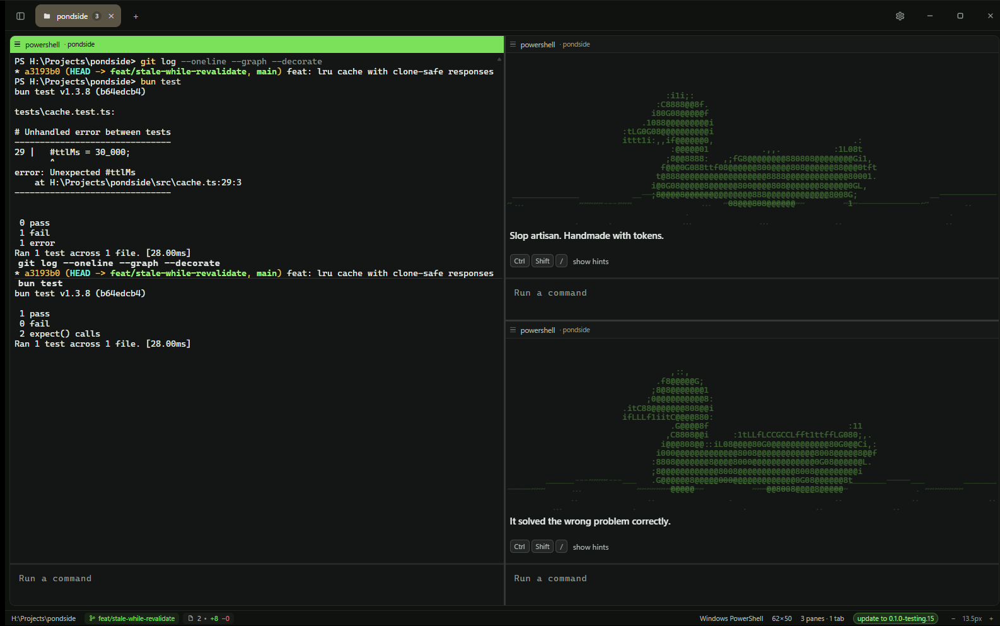

<div align="center">


# Duckweed

### A local terminal workspace for vibe coding

Open a folder and start working. Duckweed keeps real shells, coding agents, Git
context, diffs, tabs, and panes in one place. There is no Duckweed account to
create, no cloud workspace to set up, and nothing to sync before your first
command.

<p>
  <a href="https://github.com/MusicMaster4/Duckweed/releases/latest">
    
  </a>
  &nbsp;
  <a href="https://github.com/MusicMaster4/Duckweed/releases/download/channel-testing/duckweed-beta-setup.exe">
    
  </a>
</p>

<sub>Windows installer · installs without administrator rights · updates from inside the app</sub>

<br /><br />

<a href="docs/images/duckweed-workspace.png">
  
</a>

<br /><br />

<a href="#download">Download</a> ·
<a href="#what-it-does">What it does</a> ·
<a href="#agent-usage">Agent usage</a> ·
<a href="#keyboard-shortcuts">Shortcuts</a> ·
<a href="#building-from-source">Build from source</a>

</div>

## Why Duckweed exists

Vibe-coding sessions get messy fast. One agent is implementing a change, another
shell is running tests, logs are moving in a third pane, and the Git diff is
somewhere behind all of them.

Duckweed is the terminal workspace I wanted for that kind of work. It has the
freedom of a tiling layout, but it still behaves like a regular terminal. Open
your project, arrange the panes once, and let each agent or command have its own
space.

Duckweed does not host your repository or wrap your coding tools in another
service. It runs the shells and CLIs already installed on your computer. Layouts
and settings are saved locally, and agent usage is calculated from the local
session files those tools already keep.

## Download

### Stable

**[Download the latest stable release](https://github.com/MusicMaster4/Duckweed/releases/latest)**

This is the normal install and the recommended choice. The link is permanent:
GitHub always sends it to the newest stable Duckweed release. The first stable
release is being prepared, so the page may be empty until it is published.

### Beta

**[Download the newest beta installer](https://github.com/MusicMaster4/Duckweed/releases/download/channel-testing/duckweed-beta-setup.exe)**

Beta builds ship earlier and may be rough around the edges. They follow their own
update channel, so a beta install receives beta updates and a stable install only
receives stable ones. Install the other build manually whenever you want to
switch channels. The beta download URL stays the same while the file behind it is
replaced on every beta release. You can browse the
[beta release notes](https://github.com/MusicMaster4/Duckweed/releases?q=prerelease%3Atrue)
before installing.

The Windows installer is per-user. It does not ask for administrator access, and
later updates can be installed from the version chip in the status bar or from
**Check for updates** in the command palette.

> Windows SmartScreen may warn on the first install because the installer is not
> yet code-signed. Duckweed's built-in updater still verifies every update with
> the project's update signature.

## What it does

- **Real terminal sessions.** Every pane owns a PTY-backed shell: ConPTY on
  Windows and `openpty` on Linux and macOS.
- **Layouts that keep up.** Split, resize, swap, drag, or zoom panes without
  killing the process or losing its scrollback.
- **Project context at a glance.** The current project, Git branch, changed-file
  count, line totals, shell, tab, and pane count stay visible.
- **Diff review inside the workspace.** Open the complete uncommitted diff from
  the status bar or press `Ctrl+Shift+G`.
- **A useful command palette.** Projects, shells, tabs, panes, settings, and
  updates are available through `Ctrl+Shift+P`.
- **Search and readable output.** Search terminal scrollback and optionally
  highlight paths, URLs, flags, hashes, diffs, warnings, and errors.
- **Shell discovery.** Duckweed finds PowerShell, `cmd`, Git Bash, WSL, Nushell,
  Bash, Zsh, and Fish when they are installed.
- **Local persistence.** Pane arrangements come back after a restart without
  pretending the old processes are still alive.

## Agent usage

Open **Settings → Usage** to compare token use and estimated cost over the last
7, 14, 30, or 90 days. Duckweed groups the numbers by day, model, and agent, and
keeps exact values available in a table.

Current local-session support includes:

- Claude Code, Codex CLI, Gemini CLI, OpenCode, and Grok CLI
- Factory Droid, Kilo Code, Kimi CLI, Antigravity CLI, and Pi Coding Agent

The scanner reads the transcripts these tools already store on your machine. It
does not upload their contents. The first scan builds a local index; later scans
only revisit files that changed and resume append-only JSONL logs from their
last complete line.

Cost figures are estimates based on published per-token prices unless a provider
records an actual cost in the transcript. Unknown models still appear with their
tokens counted and their cost marked as unpriced.

Quota cards use provider information only when it is available locally. Claude
can query the official usage endpoint with Claude Code's existing OAuth session;
Codex and Grok use the latest quota snapshots saved by their CLIs. Duckweed does
not invent limits for agents that do not expose them.

## Keyboard shortcuts

| Shortcut | Action |
| --- | --- |
| `Ctrl+Shift+D` / `Ctrl+Shift+E` | Split right / down |
| `Ctrl+Shift+W` | Close the focused pane |
| `Ctrl+Shift+Z` | Zoom the focused pane |
| `Ctrl+Shift+B` | Equalize all panes |
| `Alt+Arrow keys` | Move focus between panes |
| `Ctrl+Shift+[` / `]` | Focus the previous / next pane |
| `Ctrl+Shift+T` / `Ctrl+Shift+Q` | New tab / close tab |
| `Ctrl+Tab` / `Ctrl+Shift+Tab` | Cycle tabs |
| `Ctrl+1` … `Ctrl+9` | Go to tab N |
| `Ctrl+Shift+O` | Open a project |
| `Ctrl+Shift+P` | Open the command palette |
| `Ctrl+Shift+G` | Review uncommitted changes |
| `Ctrl+Shift+F` | Search terminal output |
| `Ctrl+Shift+K` | Clear the focused pane |
| `Ctrl+Shift+H` | Toggle output highlighting |
| `Ctrl+=` / `Ctrl+-` / `Ctrl+0` | Increase / decrease / reset font size |
| `F11` | Toggle fullscreen |

Right-click copies a selection. With no selection, it pastes from the clipboard.

## Building from source

You will need [Bun](https://bun.sh/), [Rust](https://www.rust-lang.org/tools/install),
and the [Tauri 2 prerequisites](https://v2.tauri.app/start/prerequisites/) for
your operating system.

```bash
git clone https://github.com/MusicMaster4/Duckweed.git
cd Duckweed
bun install
bun run app
```

Build the native installer or application bundle with:

```bash
bun run app:build
```

## How it works

Duckweed has a React and TypeScript interface backed by Rust through Tauri 2.
Terminal instances live outside the React render tree, so rearranging a pane does
not recreate its process or scrollback.

```text
src/
├── components/       workspace UI, settings, palette, search, diffs, updates
├── hooks/            drag-and-drop behavior and update checks
└── lib/              layouts, terminal registry, persistence, IPC, highlighting

src-tauri/src/
├── main.rs           Tauri commands and IPC
├── pty.rs            one PTY session per pane
├── shells.rs         installed-shell discovery
├── project.rs        project and Git branch detection
└── usage/            local agent transcript and quota readers
```

The PTY stream is transported as base64 and decoded incrementally, which keeps
split UTF-8 characters intact during large bursts of output.

## Development checks

```bash
bun run typecheck
bun test
cd src-tauri && cargo check
```

Release builds come from two branches: `main` publishes stable releases and
`testing` publishes beta releases. The full versioning, signing, and updater
setup is documented in [docs/releases.md](docs/releases.md).

## Current scope

Duckweed is an active project. Projects, tabs, panes, real shells, search, Git
diffs, local usage analytics, updates, and layout persistence are implemented.

Command blocks currently group commands submitted through Duckweed's composer.
Grouping raw-mode input the same way still needs OSC 133 shell integration.

## Contributing

Issues, ideas, and pull requests are welcome. For bug reports, please include the
operating system, shell, reproduction steps, and relevant terminal output.

## License

Duckweed is source-available under the
[Duckweed Source-Available License 1.0](LICENSE.md). You may use, study, modify,
fork, and share the source for free. Selling Duckweed, charging for access to it,
or offering it as a paid service is not permitted.

This is not an open-source license as defined by the Open Source Initiative.
Future Duckweed releases may use revised terms; a release you already received
remains under the license that accompanied it.
