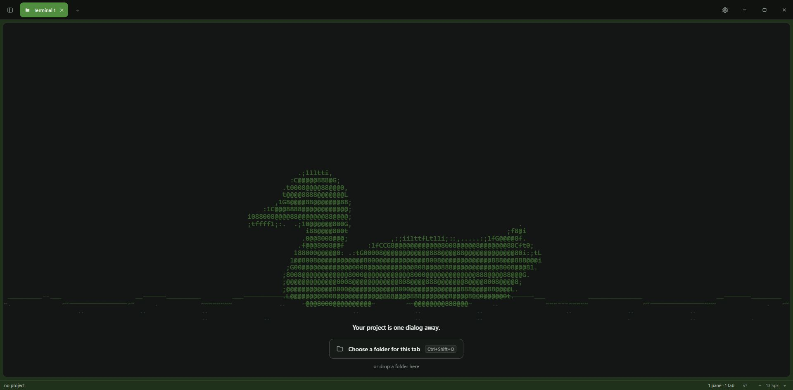
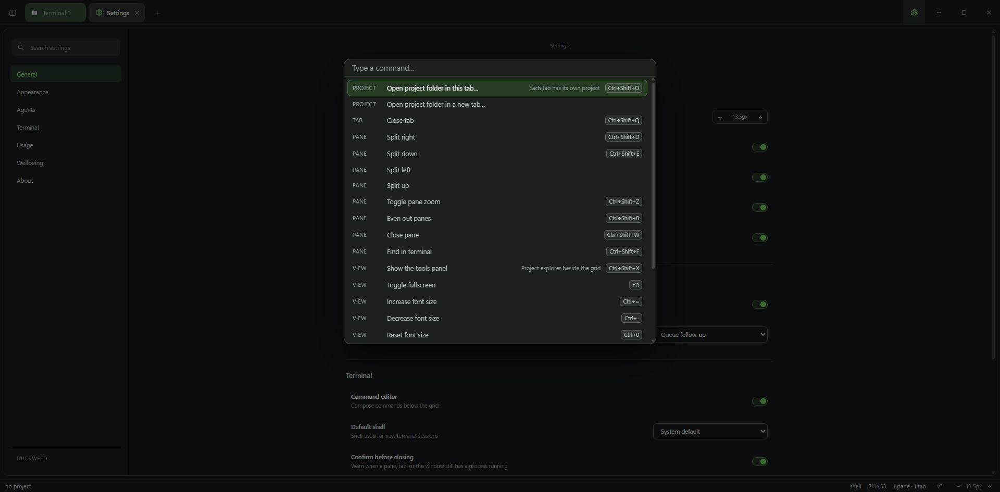
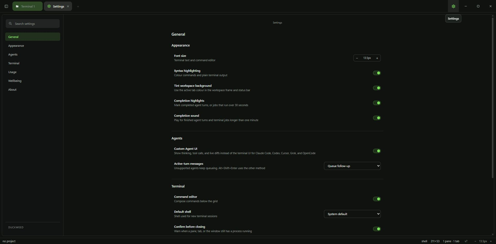
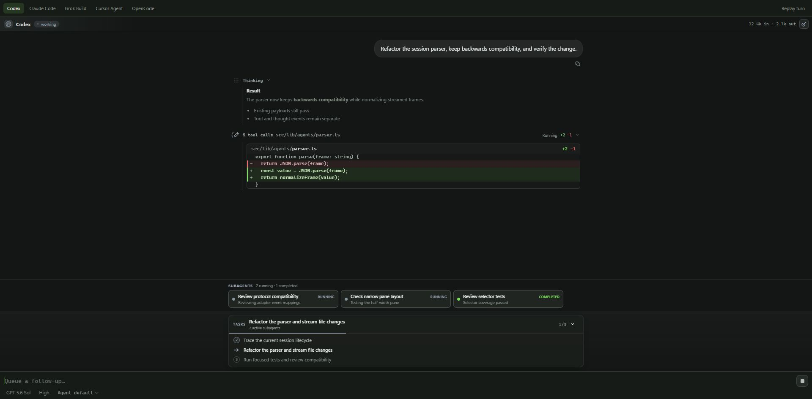
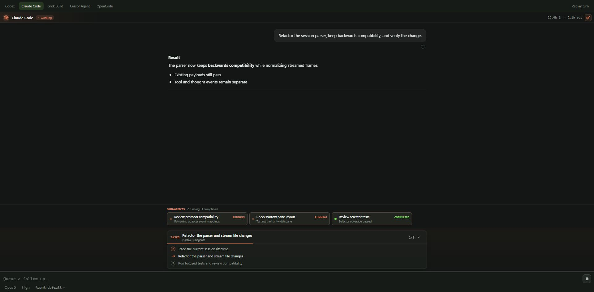
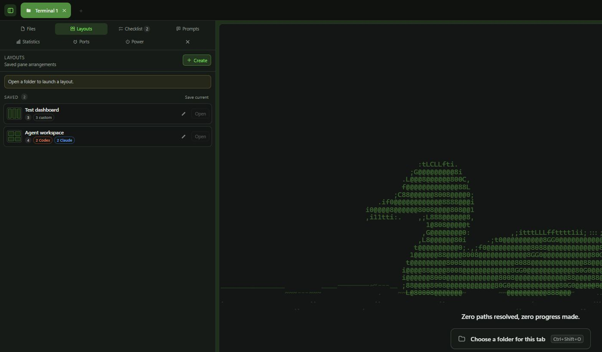
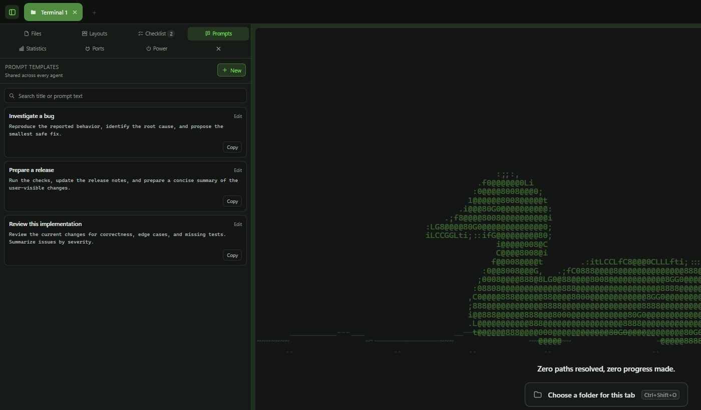
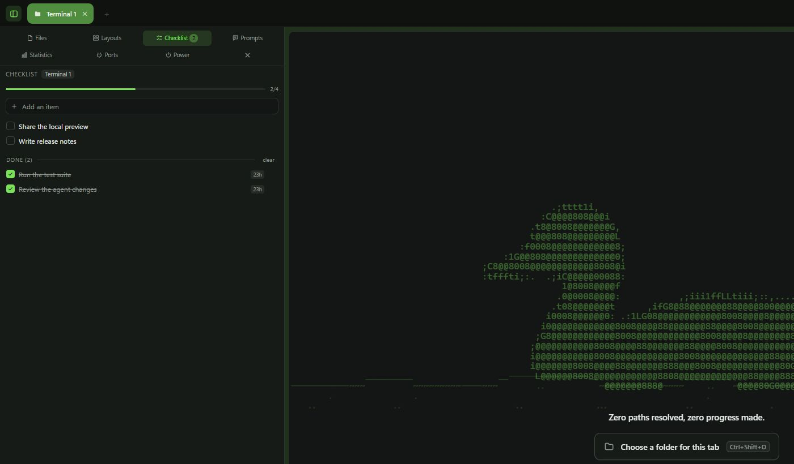
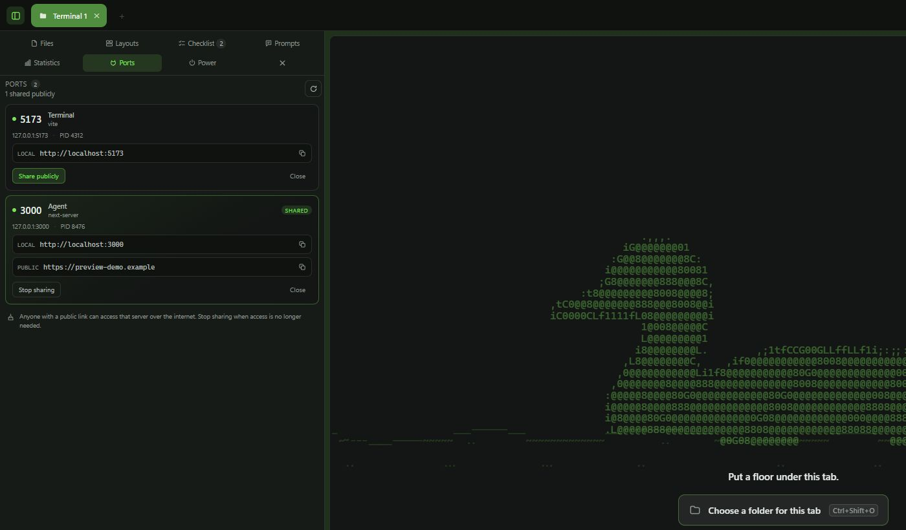
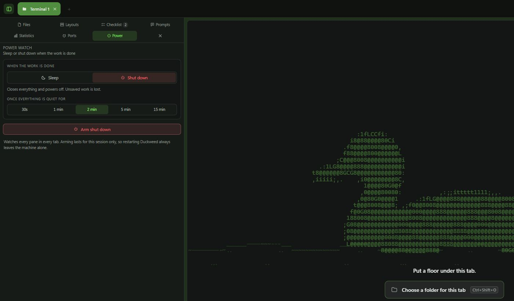

<div align="center">


# Duckweed

### A cross-platform local terminal workspace for vibe coding

Open a folder and start working. Duckweed keeps real shells, coding agents, Git
context, diffs, tabs, and panes in one place across Windows, macOS, and Linux.
There is no Duckweed account to create, no cloud workspace to set up, and
nothing to sync before your first command.

Launch several coding agents side by side in the same window. Duckweed gives
each one a dedicated interface for conversations, tool calls, plans,
permissions, and file changes, without taking away the terminal when you need
it.

<p>
  <a href="https://github.com/MusicMaster4/Duckweed/releases/latest">
    
  </a>
  &nbsp;
  <a href="https://github.com/MusicMaster4/Duckweed/releases/download/channel-testing/duckweed-beta-setup.exe">
    
  </a>
</p>

<sub>Windows x64 · macOS universal · Linux x64 · signed in-app updates</sub>

<br /><br />

<a href="docs/images/duckweed-welcome.png">
  
</a>

<br /><br />

<a href="#download">Download</a> ·
<a href="#screenshots">Screenshots</a> ·
<a href="#workspace-tools">Workspace tools</a> ·
<a href="#what-it-does">What it does</a> ·
<a href="#agent-usage">Agent usage</a> ·
<a href="#keyboard-shortcuts">Shortcuts</a> ·
<a href="#building-from-source">Build from source</a> ·
<a href="#contributing">Contributing</a>

</div>

## Screenshots

These images were captured from the running app with built-in demo content. No
accounts, credentials, personal paths, or private project data are shown.

<table>
  <tr>
    <td width="50%" valign="top">
      <a href="docs/images/duckweed-command-palette.png">
        
      </a>
      <br />
      <sub><strong>Command palette.</strong> Project, pane, terminal, and view actions stay one shortcut away.</sub>
    </td>
    <td width="50%" valign="top">
      <a href="docs/images/duckweed-settings.png">
        
      </a>
      <br />
      <sub><strong>Local settings.</strong> Tune the terminal, agent experience, completion signals, and workspace behavior.</sub>
    </td>
  </tr>
  <tr>
    <td width="50%" valign="top">
      <a href="docs/images/duckweed-agent-codex.png">
        
      </a>
      <br />
      <sub><strong>Codex interface.</strong> Follow reasoning, diffs, delegated subagents, and plan progress in one timeline.</sub>
    </td>
    <td width="50%" valign="top">
      <a href="docs/images/duckweed-agent-claude.png">
        
      </a>
      <br />
      <sub><strong>Claude Code interface.</strong> The same focused workspace adapts to each provider's identity and capabilities.</sub>
    </td>
  </tr>
</table>

## Workspace tools

Coding agents do not work in isolation. You still need to remember the finish
line, reuse good instructions, keep servers within reach, and decide what should
happen when a long-running job finishes. Duckweed keeps that surrounding work
inside a dock that shares the window with your terminals and agents. Open it
with `Ctrl+Shift+X`, switch tools without covering your panes, and resize it to
fit the task.

The captures below use only built-in demo content. The project is intentionally
unattached, every prompt and checklist item is fictional, and the port IDs and
addresses are synthetic. No account, local path, repository content, credential,
or real public tunnel appears in these images.

### Turn a working setup into a reusable layout

Save the current pane arrangement or design a layout from scratch. A layout can
open plain shells, start a command in each pane, launch a group of Codex or
Claude agents, or mix them in the same grid. You can keep up to 16 panes in one
template and optionally make a saved layout the default for restored tabs.

<a href="docs/images/duckweed-tools-layouts.png">
  
</a>

<sub><strong>Saved layouts.</strong> Recreate the workspace and its startup commands instead of rebuilding the same split every session.</sub>

### Keep the instructions and the finish line close

Prompt templates hold the instructions worth using again. Search them, copy
them, or drag a card directly into any terminal or agent composer. Templates are
shared across the app, so a good review or release prompt is available wherever
you need it.

The checklist is deliberately scoped to one tab. Write down what that workspace
must accomplish, check off completed work, and keep the remaining count visible
even while another tool is open. Finished items stay visible for a day before
they clear themselves, and every list survives restarts and updates.

<table>
  <tr>
    <td width="50%" valign="top">
      <a href="docs/images/duckweed-tools-prompts.png">
        
      </a>
      <br />
      <sub><strong>Reusable prompts.</strong> Save once, then copy or drag a prompt into any shell or agent.</sub>
    </td>
    <td width="50%" valign="top">
      <a href="docs/images/duckweed-tools-checklist.png">
        
      </a>
      <br />
      <sub><strong>Per-tab checklist.</strong> Keep the acceptance criteria beside the work and see progress at a glance.</sub>
    </td>
  </tr>
</table>

### Turn a local server into a shareable preview

The Ports tool finds listening servers started by panes and agents in the
current tab. Open or copy a local address, stop the owning process, or create a
temporary public HTTPS link without leaving Duckweed. Shared servers remain
clearly marked, and their tunnels stop when you stop sharing, close the process,
or exit the app.

<a href="docs/images/duckweed-tools-ports.png">
  
</a>

<sub><strong>Local and public addresses.</strong> See which pane owns a server, copy its URL, and control sharing from the same workspace.</sub>

> A public link lets anyone who has it reach that development server. Treat it
> as temporary access, do not expose secrets or production data, and stop
> sharing when the review is over.

### Let the agents finish, then power down

Power watch is built for long tests, builds, and unattended agent runs. Choose
sleep or shutdown, select how long every pane must remain quiet, and arm the
watch. Duckweed monitors all panes in all tabs, waits through the cooldown, and
gives you a visible countdown with time to cancel before the operating system
action runs. Restarting Duckweed always leaves the machine alone.

<a href="docs/images/duckweed-tools-power.png">
  
</a>

<sub><strong>Power watch.</strong> Start the long job, arm a cooldown, and walk away without leaving the computer running all night.</sub>

### Everything in the dock

| Tool | What it keeps within reach |
| --- | --- |
| **Files** | Browse the current project, search across open projects, open files in the built-in editor, and insert paths into a terminal or agent. |
| **Layouts** | Save pane arrangements with optional startup commands and reopen them for another task. |
| **Checklist** | Maintain a persistent task list for each tab, including progress and recently finished items. |
| **Prompts** | Search, edit, copy, and drag reusable instructions into any shell or agent composer. |
| **Statistics** | Follow session uptime, estimated agent cost, tokens, request counts, workspace size, listening ports, and saved commands. |
| **Ports** | Inspect local servers, copy or open addresses, share a temporary public preview, and stop sharing or close the process. |
| **Power** | Sleep or shut down the computer after every pane has stayed idle for the selected cooldown. |

## Why Duckweed exists

Vibe-coding sessions get messy fast. One agent is implementing a change, another
shell is running tests, logs are moving in a third pane, and the Git diff is
somewhere behind all of them.

Duckweed is the terminal workspace I wanted for that kind of work. It has the
freedom of a tiling layout, but it still behaves like a regular terminal. Open
your project, arrange the panes once, and let each agent or command have its own
space. Multiple panes can show Duckweed's custom agent interface at the same
time, so separate agents can work in parallel without being spread across
separate application windows.

Duckweed does not host your repository or wrap your coding tools in another
service. It runs the shells and CLIs already installed on your computer. Layouts
and settings are saved locally, and agent usage is calculated from the local
session files those tools already keep.

## Try it in five minutes

1. [Download the latest stable release](https://github.com/MusicMaster4/Duckweed/releases/latest).
2. Open the folder for the project you are working on.
3. Press `Ctrl+Shift+D` or `Ctrl+Shift+E` to make a second pane.
4. Keep a normal shell in one pane, launch your coding agent in another, and
   run tests in a third when you need it.
5. Use `Ctrl+Shift+G` to review the uncommitted diff before you commit.

Duckweed does not install coding agents, create provider accounts, or provide
API credentials. Install and sign in to the CLIs you already use first, then
confirm each one works in a regular terminal. The [quick start](docs/quickstart.md)
has platform notes and a first-workspace walkthrough.

Duckweed is a good fit when you want several local shells or agent interfaces
visible at once. If you only need one fast terminal, or already have a layout
you love in tmux, Ghostty, or WezTerm, keep using that.

## Download

### Stable

**[Download the latest stable release](https://github.com/MusicMaster4/Duckweed/releases/latest)**

This is the normal install and the recommended choice. The link is permanent:
GitHub always sends it to the newest stable Duckweed release.

### Beta

**[Download the newest Windows beta installer](https://github.com/MusicMaster4/Duckweed/releases/download/channel-testing/duckweed-beta-setup.exe)**

Beta builds ship earlier and may be rough around the edges. They follow their own
update channel, so a beta install receives beta updates and a stable install only
receives stable ones. Install the other build manually whenever you want to
switch channels. The beta download URL stays the same while the file behind it is
replaced on every beta release. macOS and Linux beta packages are attached to
each [versioned beta release](https://github.com/MusicMaster4/Duckweed/releases?q=prerelease%3Atrue).

### Android companion

Install the [stable Android companion](https://github.com/MusicMaster4/Duckweed/releases/latest/download/duckweed-companion.apk)
or the [beta Android companion](https://github.com/MusicMaster4/Duckweed/releases/download/channel-testing/duckweed-companion-beta.apk)
to receive encrypted agent-completion notifications and read the completed
response on your phone. Pair it from **Settings > Agents > Mobile
notifications**. See [mobile notifications](docs/mobile-notifications.md) for
the privacy model and deployment setup.

The desktop download action displays a phone-scannable QR code. After install,
the companion's **Updates** tab checks its own stable or beta feed, verifies the
APK checksum, and opens Android's installation confirmation.

The Windows installer is per-user. It does not ask for administrator access, and
later updates can be installed from the version chip in the status bar or from
**Check for updates** in the command palette.

> Windows SmartScreen may warn on the first install because the installer is not
> yet code-signed. Duckweed's built-in updater still verifies every update with
> the project's update signature.

If the first launch does not go smoothly, start with
[troubleshooting](docs/troubleshooting.md). For a reproducible bug, the
[bug-report form](https://github.com/MusicMaster4/Duckweed/issues/new?template=bug_report.yml)
asks for the small amount of platform and shell information that makes a fix
possible.

## Platform support and prerequisites

Official releases include:

| Platform | Package | Update behavior |
| --- | --- | --- |
| Windows x64 | NSIS `.exe` | In-app updater |
| macOS Intel and Apple Silicon | Universal `.dmg` | In-app updater |
| Linux x64 | `.AppImage` | In-app updater |
| Debian and Ubuntu x64 | `.deb` | In-app updater with an authentication prompt |

On macOS, open the DMG and move Duckweed to Applications. Until the optional
Apple Developer ID and notarization credentials are configured for releases,
Gatekeeper may require right-clicking Duckweed and choosing **Open** on first
launch.

On Linux, make the AppImage executable before its first launch:

```bash
chmod +x Duckweed_*.AppImage
```

The AppImage updates itself in place. The deb package uses the system package
installer for updates, so Linux asks for authentication before applying one.

Windows Explorer folder actions and the taskbar completion badge remain
Windows-only. Their settings stay hidden on macOS and Linux.

Duckweed runs shells and coding-agent CLIs that are already installed on your
computer. Before launching an agent in Duckweed, install its CLI, sign in or
configure its provider credentials, and confirm that its command works in a
regular terminal. Duckweed does not provide agent accounts, subscriptions, or
API credentials.

## What it does

- **Real terminal sessions.** Every pane owns a PTY-backed shell: ConPTY on
  Windows and `openpty` on Linux and macOS.
- **Layouts that keep up.** Split, resize, swap, drag, or zoom panes without
  killing the process or losing its scrollback.
- **Project context at a glance.** The current project, Git branch, changed-file
  count, line totals, shell, tab, and pane count stay visible.
- **Diff review inside the workspace.** Open the complete uncommitted diff from
  the status bar or press `Ctrl+Shift+G`.
- **A useful command palette.** Projects, shells, tabs, panes, settings, and
  updates are available through `Ctrl+Shift+P`.
- **First-class coding agent interfaces.** Launch Claude Code, Codex, Cursor
  Agent, Grok, or OpenCode in a pane and Duckweed can replace the terminal UI
  with a native conversation, tool, plan, permission, and diff timeline. Run
  several of these interfaces side by side in the same window.
- **Search and readable output.** Search terminal scrollback and optionally
  highlight paths, URLs, flags, hashes, diffs, warnings, and errors.
- **Shell discovery.** Duckweed finds PowerShell, `cmd`, Git Bash, WSL, Nushell,
  Bash, Zsh, and Fish when they are installed.
- **Workspace tools.** A resizable dock (`Ctrl+Shift+X`) for files, saved pane
  layouts, reusable prompts, per-tab checklists, session statistics, local and
  shared ports, and automatic sleep or shutdown. See every tool in
  [Workspace tools](#workspace-tools).
- **Explorer integration.** Per-user context-menu entries open a folder in a new
  Duckweed tab or window straight from Windows Explorer, without administrator
  rights. Both entries can be toggled in the settings.
- **Completion signals.** Finished agent turns and commands can play a
  completion sound, highlight the pane, and outline the taskbar icon so you
  notice from another window. Tabs also show when an agent is still working in
  the background.
- **Local persistence.** Pane arrangements come back after a restart without
  pretending the old processes are still alive.

## Coding agents

When the custom agent UI is enabled, launching `claude`, `codex`, `agent`,
`grok`, or `opencode` opens a focused interface inside the current pane. The
installed CLI still runs locally and keeps its own authentication and provider
configuration.

Each pane owns its agent session. Split the workspace and launch another agent
to keep multiple custom interfaces visible and working at once, all within the
same Duckweed window. You can mix agent interfaces and regular shells in any
layout.

The interface presents streamed responses, reasoning, tool calls, file changes,
plans, permission requests, token usage, and session history in a consistent
timeline while preserving each provider's identity. When Claude Code stops to
ask you something, the question arrives as a card you can answer by clicking a
choice, by pressing its number, or by writing an answer of your own. The composer supports slash
commands, workspace file mentions, queued follow-ups, and image attachments
where the provider accepts them. Model and reasoning controls appear when the
agent protocol exposes those choices.

In Codex sessions, delegated subagents appear as a live fleet above the
conversation. Open one to inspect its status, prompt, child conversation, tool
activity, plan, output, and file changes. When the child thread accepts input,
you can send it a follow-up or redirect it without leaving the parent session.

### Commands, skills, apps, and provider features

The agent composer uses different prefixes for different kinds of input:

- Type `/` to browse commands exposed by the CLI, such as `/model`, `/effort`,
  `/compact`, or `/rewind` when the active provider supports them.
- Type `$` to browse filesystem-backed skills from `.agents/skills` and the
  active provider's local skill directory, such as `.codex/skills` or
  `.claude/skills`. Plugin and app bundles stay in **Extensions** instead of
  crowding this picker.
- Type `@` to browse installed apps and connectors. Workspace file mentions
  continue to use `@` when no matching provider app is available.

Typing `$` scans local skill folders automatically. Shared `.agents/skills`
entries work with every custom agent: Codex receives its structured skill
reference, while other providers are directed to read and apply the selected
`SKILL.md`. Typing `@` loads the provider's installed app inventory. Use
**Refresh** under the three-line provider-features button after installing or
changing an extension during an existing session. The same panel contains:

- **Extensions**, for skills, apps, plugins, MCP servers, hooks, workflows, and
  provider agents reported by the running CLI.
- **Tasks**, for background workflows, tasks, and Codex background terminals.
- **Support**, for the capabilities negotiated with the provider, including
  accepted input types, questions, forms, extensions, and runtime features.

Choose **Open native interface** under Support when a feature is available only
in the provider's terminal UI. Duckweed closes the structured harness and, when
the provider supports it, resumes the same conversation in the native CLI.
Finish or stop the active turn before switching interfaces.

Extension availability depends on the installed CLI version, account, plugins,
MCP configuration, and workspace settings. If Duckweed was already running
while you installed an update or rebuilt it from source, restart the app before
testing the new interface. Desktop Computer Use, screen control, mouse control,
and keyboard automation are intentionally not integrated into the custom agent
UI.

Supported custom interfaces currently include:

- Claude Code and compatible Claudex launches
- Codex CLI
- Cursor Agent
- Grok CLI
- OpenCode

The longer list in [Agent usage](#agent-usage) includes tools whose local
transcripts Duckweed can measure even when they do not have a custom agent
interface. Usage scanning support does not imply custom-interface support.

Turn off **Custom Agent UI** from the command palette whenever you prefer to use
an agent's original terminal interface for new launches. Existing sessions keep
their current interface and continue running until you exit them.

## Agent usage

Open **Settings → Usage** to compare token use and estimated cost over the last
7, 14, 30, or 90 days. Duckweed groups the numbers by day, model, and agent, and
keeps exact values available in a table.

Current local-session support includes:

- Claude Code, Codex CLI, Gemini CLI, OpenCode, and Grok CLI
- Factory Droid, Kilo Code, Kimi CLI, Antigravity CLI, and Pi Coding Agent

The scanner reads the transcripts these tools already store on your machine. It
does not upload their contents. The first scan builds a local index; later scans
only revisit files that changed and resume append-only JSONL logs from their
last complete line.

Cost figures are estimates based on published per-token prices unless a provider
records an actual cost in the transcript. Unknown models still appear with their
tokens counted and their cost marked as unpriced.

Quota cards use provider information only when it is available locally. Claude
can query the official usage endpoint with Claude Code's existing OAuth session;
Codex and Grok use the latest quota snapshots saved by their CLIs. Duckweed does
not invent limits for agents that do not expose them.

## Local data and public sharing

Projects, layouts, settings, agent sessions, and usage indexes stay on your
computer. Duckweed does not upload repository contents or agent transcripts.
Provider CLIs may still contact their own services, and Claude quota cards can
query Claude's official usage endpoint with the local Claude Code session.

The Ports tool's **Share publicly** action creates a temporary HTTPS address
through an outbound SSH tunnel when OpenSSH is installed. Duckweed falls back
to Cloudflare Quick Tunnels or ngrok when needed. Anyone with that address can reach
the selected local HTTP server over the internet. Public links are intended for
development and testing, not production. Duckweed shows the link only after an
end-to-end readiness check reaches its local proxy. It stops the tunnel when you
stop sharing, close the owning process, or exit the app.

## Keyboard shortcuts

| Shortcut | Action |
| --- | --- |
| `Ctrl+Shift+D` / `Ctrl+Shift+E` | Split right / down |
| `Ctrl+Shift+W` | Close the focused pane |
| `Ctrl+Shift+Z` | Zoom the focused pane |
| `Ctrl+Shift+B` | Equalize all panes |
| `Alt+Arrow keys` | Move focus between panes |
| `Ctrl+Shift+[` / `]` | Focus the previous / next pane |
| `Ctrl+Shift+T` / `Ctrl+Shift+Q` | New tab / close tab |
| `Ctrl+Tab` / `Ctrl+Shift+Tab` | Cycle tabs |
| `Ctrl+1` … `Ctrl+9` | Go to tab N |
| `Ctrl+Shift+O` | Open a project |
| `Ctrl+Shift+P` | Open the command palette |
| `Ctrl+Shift+G` | Review uncommitted changes |
| `Ctrl+Shift+X` | Toggle the workspace tools panel |
| `Ctrl+Shift+F` | Search terminal output |
| `Ctrl+Shift+K` | Clear the focused pane |
| `Ctrl+Shift+H` | Toggle output highlighting |
| `Ctrl+=` / `Ctrl+-` / `Ctrl+0` | Increase / decrease / reset font size |
| `F11` | Toggle fullscreen |

Right-click copies a selection. With no selection, it pastes from the clipboard.

## Building from source

You will need [Bun](https://bun.sh/), [Rust](https://www.rust-lang.org/tools/install),
and the [Tauri 2 prerequisites](https://v2.tauri.app/start/prerequisites/) for
your operating system. Duckweed's locked Rust crates require Rust 1.88 or newer.

```bash
git clone https://github.com/MusicMaster4/Duckweed.git
cd Duckweed
bun install
bun run app
```

`bun run app` starts Tauri without watching the Rust backend. During backend
development, use `bun run app:watch` to rebuild when Rust files change.

Build the native installer or application bundle with:

```bash
bun run app:build
```

## How it works

Duckweed has a React and TypeScript interface backed by Rust through Tauri 2.
Terminal instances live outside the React render tree, so rearranging a pane does
not recreate its process or scrollback.

```text
src/
├── components/       workspace UI, agent interfaces, settings, palette, search,
│                     diffs, tools panel, updates
├── hooks/            drag-and-drop behavior, Git change polling, update checks
└── lib/              layouts, terminal registry, agent adapters, persistence,
                      IPC, highlighting

src-tauri/src/
├── main.rs                Tauri commands and IPC
├── pty.rs                 one PTY session per pane
├── shells.rs              installed-shell discovery
├── project.rs             project and Git branch detection
├── git.rs                 diff and change collection
├── launch.rs              coding agent launch detection
├── agent_proc.rs          agent process supervision
├── agent_sessions.rs      agent session storage
├── agent_activity.rs      agent turn and activity tracking
├── ports.rs               listening-port discovery and forwarding
├── watch.rs / power.rs    power watch and sleep or shutdown actions
├── process_tree.rs        pane process inspection
├── fs.rs                  project file browsing
├── shell_integration.rs   Windows Explorer context-menu entries
└── usage/                 local agent transcript and quota readers
```

The PTY stream is transported as base64 and decoded incrementally, which keeps
split UTF-8 characters intact during large bursts of output.

## Development checks

```bash
bun run typecheck
bun test
cd src-tauri && cargo check
```

GitHub CI runs the TypeScript check, Bun test suite, and `cargo check` on Linux,
macOS, and Windows. Native release packaging is also performed on the matching
operating system before a release can be published.

Release builds come from two branches: `main` publishes stable releases and
`testing` publishes beta releases. The full versioning, signing, and updater
setup is documented in [docs/releases.md](docs/releases.md).

The Android companion and encrypted notification relay live in `android/` and
`relay/`. Their free Cloudflare/FCM, signing, and release setup is documented in
[docs/mobile-notifications.md](docs/mobile-notifications.md).

## Current scope

Duckweed is an active project. Projects, tabs, panes, real shells, custom coding
agent interfaces, search, Git diffs, local usage analytics, workspace tools
(files, saved layouts, prompt templates, checklists, statistics, ports, power
watch), completion signals, Explorer integration, updates, and layout
persistence are implemented.

Command blocks group commands submitted through Duckweed's composer and raw
PowerShell input. Duckweed's OSC 133 shell integration preserves edited command
text, command boundaries, exit status, and duration for block navigation, copy,
and re-run.

## Contributing

Issues, ideas, and pull requests are welcome. For bug reports, please include the
operating system, shell, reproduction steps, and relevant terminal output.

Most contributions branch from `testing` and open a pull request back into
`testing`. A successful code merge publishes a beta for validation. Maintainers
later promote tested changes from `testing` to `main`, which publishes the
stable release.

Read [CONTRIBUTING.md](CONTRIBUTING.md) for development setup, required checks,
branch conventions, pull request expectations, and the complete release flow.

## License

Duckweed is source-available under the
[Duckweed Source-Available License 1.0](LICENSE.md). You may use, study, modify,
fork, and share the source for free. Selling Duckweed, charging for access to it,
or offering it as a paid service is not permitted.

This is not an open-source license as defined by the Open Source Initiative.
Future Duckweed releases may use revised terms; a release you already received
remains under the license that accompanied it.
